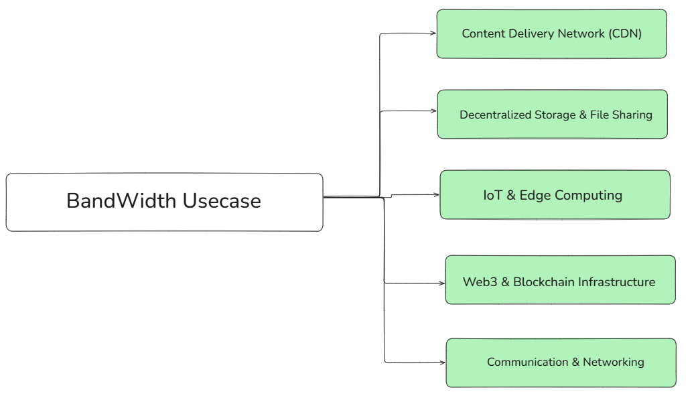
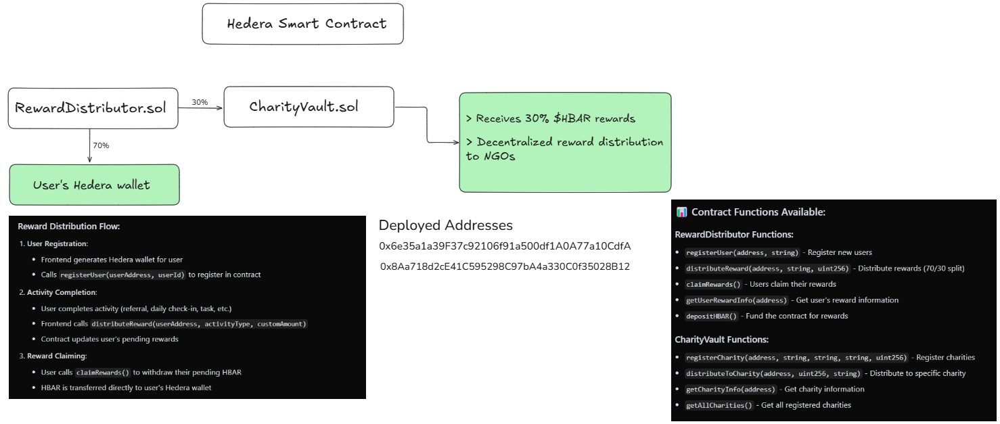

# 🤖 AIDEN - AI-Driven DePIN Network

<div align="center">
  
  
  **Decentralized Physical Infrastructure Network with AI-Powered Resource Optimization**
  
  [](https://hedera.com)
  [](https://depin.com)
  [](https://openai.com)
  [](LICENSE)
</div>

---

## 📋 Table of Contents

- [🎯 Problem Statement](#-problem-statement)
- [💡 Solution Overview](#-solution-overview)
- [🏗️ Architecture](#️-architecture)
- [🌐 Bandwidth Use Case](#-bandwidth-use-case)
- [⛓️ Hedera Smart Contract Implementation](#️-hedera-smart-contract-implementation)
- [💰 Reward Distribution System](#-reward-distribution-system)
- [🤝 Community-Backed Reasons](#-community-backed-reasons)
- [👥 User Flows](#-user-flows)
- [🗺️ Roadmap](#️-roadmap)
- [🔗 Why Hedera?](#-why-hedera)
- [💼 Revenue Strategy](#-revenue-strategy)
- [📱 Socials & Contact](#-socials--contact)
- [🚀 Getting Started](#-getting-started)

---

## 🎯 Problem Statement

### The Digital Divide Challenge

Across Africa and developing regions, millions face significant barriers to digital inclusion:

- **High Internet Costs**: Expensive bandwidth limits access to education, healthcare, and economic opportunities
- **Infrastructure Gaps**: Uneven distribution of network resources creates digital deserts
- **Underutilized Resources**: Idle device resources (bandwidth, compute, storage) remain untapped
- **Limited Economic Opportunities**: Few ways for individuals to monetize their digital assets
- **Charitable Giving Complexity**: Lack of transparent, automated systems for social impact

### The Opportunity

AIDEN addresses these challenges by creating a decentralized marketplace where:
- Users can monetize their idle resources
- Communities can access affordable, reliable connectivity
- Charitable giving becomes automated and transparent
- AI optimizes resource allocation for maximum efficiency

---

## 💡 Solution Overview

AIDEN is a comprehensive **DePIN (Decentralized Physical Infrastructure Network)** platform that combines:

### 🔧 Core Components

1. **DePIN Resource Sharing**
   - Bandwidth contribution and measurement
   - Compute power sharing for AI tasks
   - Storage capacity utilization
   - Real-time resource monitoring

2. **AI-Powered Optimization**
   - Smart task matching algorithms
   - Dynamic resource allocation
   - Performance optimization
   - Network health monitoring

3. **Automated Reward System**
   - 70% earnings to personal savings vault
   - 30% automatic charity donations
   - Real-time HBAR token distribution
   - Transparent on-chain tracking

4. **Community Impact Platform**
   - Transparent charity distribution
   - Impact tracking and reporting
   - Community development projects
   - Social good initiatives

---

## 🏗️ Architecture

### System Architecture Overview

```
┌─────────────────────────────────────────────────────────────────┐
│                        AIDEN PLATFORM                          │
├─────────────────────────────────────────────────────────────────┤
│  Frontend (React + Material-UI)                                │
│  ├── User Dashboard                                            │
│  ├── Resource Management                                       │
│  ├── Charity Impact Tracking                                   │
│  └── Real-time Analytics                                       │
├─────────────────────────────────────────────────────────────────┤
│  Backend Services (Node.js + TypeScript)                       │
│  ├── DePIN Service (Bandwidth Measurement)                     │
│  ├── Reward Agent (Automated Distribution)                     │
│  ├── Contract Service (Hedera Integration)                     │
│  └── User Management (Authentication)                          │
├─────────────────────────────────────────────────────────────────┤
│  Hedera Hashgraph Network                                      │
│  ├── RewardDistributor Smart Contract                          │
│  ├── CharityVault Smart Contract                               │
│  ├── HBAR Token Transactions                                   │
│  └── On-chain Transparency                                     │
├─────────────────────────────────────────────────────────────────┤
│  AI Optimization Layer                                         │
│  ├── Resource Matching Algorithms                              │
│  ├── Performance Optimization                                  │
│  ├── Network Health Monitoring                                 │
│  └── Predictive Analytics                                      │
└─────────────────────────────────────────────────────────────────┘
```

### Key Features

- **Real-time Bandwidth Measurement**: Accurate speed tests and usage tracking
- **Embedded Hedera Wallets**: Automatic wallet creation for each user
- **Proof-of-Bandwidth Protocol**: Cryptographic verification of contributions
- **Automated Reward Distribution**: Daily HBAR distribution via smart contracts
- **Transparent Charity System**: On-chain tracking of all donations

---

## 🌐 Bandwidth Use Case

### How AIDEN Works

<div align="center">
  
</div>

### Detailed Use Case Flow

1. **Resource Contribution**
   - Users connect their devices to the AIDEN network
   - System measures available bandwidth, compute, and storage
   - AI agent matches resources with demand

2. **Bandwidth Measurement**
   - Real-time speed tests (download/upload/latency)
   - Usage tracking and session management
   - Cryptographic proof generation

3. **Reward Calculation**
   - 1 MB bandwidth served = 1 point
   - 1 point = 0.001 HBAR
   - Real-time point accumulation

4. **Automated Distribution**
   - Daily reward distribution at midnight UTC
   - 70% to user savings vault
   - 30% to charity projects

### Benefits

- **For Providers**: Monetize idle resources, earn passive income
- **For Consumers**: Access affordable, reliable connectivity
- **For Communities**: Transparent charitable impact, digital inclusion

---

## ⛓️ Hedera Smart Contract Implementation

### Contract Architecture

<div align="center">
  
</div>

### Core Smart Contracts

#### 1. RewardDistributor Contract

```solidity
// Key Features:
- User registration and management
- Automated reward distribution (70/30 split)
- Batch processing for efficiency
- Activity-based reward system
- Hedera-compatible HBAR transfers
```

**Key Functions:**
- `registerUser(address _user, string _userId)`
- `batchDistributeRewards(address[] _users, uint256[] _amounts, string _activityType)`
- `claimRewards()` - Users claim their 70% portion
- `getUserRewardInfo(address _user)` - View reward statistics

#### 2. CharityVault Contract

```solidity
// Key Features:
- Multi-charity support with percentage allocation
- Transparent donation tracking
- Automated distribution to registered NGOs
- Impact reporting and analytics
```

**Key Functions:**
- `registerCharity(address _charityAddress, string _name, ...)`
- `receiveDonation(address _source, string _cause)`
- `distributeToCharity(address _charityAddress, uint256 _amount, string _cause)`
- `getCharityInfo(address _charityAddress)` - View charity statistics

### Contract Deployment

**Testnet Addresses:**
- **RewardDistributor**: `0x6e35a1a39F37c92106f91a500df1A0A77a10CdfA`
- **CharityVault**: `0x8Aa718d2cE41C595298C97bA4a330C0f35028B12`

### Security Features

- **Access Control**: Owner and authorized distributor roles
- **Input Validation**: Comprehensive parameter checking
- **Emergency Functions**: Withdrawal capabilities for contract owner
- **Event Logging**: Complete transaction history on-chain

---

## 💰 Reward Distribution System

### Automated Daily Distribution

```
┌─────────────────┐    ┌──────────────────┐    ┌─────────────────┐
│   Midnight      │───▶│  Data Collection │───▶│   Calculation   │
│   Cron Trigger  │    │  (Users + Points)│    │ (Points → HBAR) │
└─────────────────┘    └──────────────────┘    └─────────────────┘
                                                         │
┌─────────────────┐    ┌──────────────────┐    ┌─────────────────┐
│   Reset Points  │◀───│   Logging &      │◀───│   Distribution  │
│   (Today = 0)   │    │   Statistics     │    │ (70% Users,     │
└─────────────────┘    └──────────────────┘    │  30% Charity)   │
                                               └─────────────────┘
                                                         │
                                               ┌─────────────────┐
                                               │   Funding       │
                                               │ (Centralized →  │
                                               │  Contract)      │
                                               └─────────────────┘
```

### Reward Calculation

- **Points System**: 1 MB bandwidth = 1 point
- **HBAR Conversion**: 1 point = 0.001 HBAR
- **Distribution Split**: 70% users, 30% charity
- **Daily Reset**: Points reset after each distribution

### Charity Distribution

The 30% charity portion is automatically distributed to registered NGOs:

- **Children's Education Fund**: 40% of charity donations
- **Environmental Protection**: 35% of charity donations  
- **Healthcare Support**: 25% of charity donations

### Transparency Features

- **On-chain Tracking**: All transactions recorded on Hedera
- **Real-time Statistics**: Live dashboard with impact metrics
- **Audit Trail**: Complete history of all distributions
- **Public Verification**: Anyone can verify charity distributions

---

## 🤝 Community-Backed Reasons

### Why Communities Support AIDEN

#### 1. **Digital Inclusion**
- Provides affordable internet access to underserved areas
- Bridges the digital divide through peer-to-peer sharing
- Enables economic opportunities in remote regions

#### 2. **Transparent Impact**
- Every charity donation is tracked on-chain
- Real-time impact reporting and analytics
- Community-driven project selection

#### 3. **Economic Empowerment**
- Individuals can monetize their idle resources
- Passive income generation through resource sharing
- Automated wealth building through savings vaults

#### 4. **Social Good Integration**
- Seamless charitable giving without additional effort
- Support for education, healthcare, and community development
- Transparent allocation of funds to verified organizations

#### 5. **Decentralized Governance**
- Community-driven decision making
- Transparent resource allocation
- No central authority controlling the network

### Community Benefits

- **For Individuals**: Earn money while contributing to social good
- **For Communities**: Access to affordable connectivity and services
- **For Charities**: Transparent, automated funding streams
- **For Society**: Reduced digital inequality and increased economic participation

---

## 👥 User Flows

### 1. New User Onboarding

```
User Visits AIDEN → Create Account → Automatic Hedera Wallet Creation → 
Email Verification → Complete Profile Setup → Access Dashboard
```

### 2. Resource Contribution Flow

```
User Dashboard → Create DePIN Node → Configure Resource Settings → 
Activate Node → Start Bandwidth Measurement → Real-time Points Accumulation → 
Daily Reward Distribution
```

### 3. Reward Claiming Process

```
Daily Distribution Trigger → Calculate User Points → Convert Points to HBAR → 
70% to User Vault → 30% to Charity Vault → Update User Statistics → 
Reset Daily Points
```

### 4. Charity Impact Tracking

```
Charity Donations Received → Distribute to NGOs → Update Impact Metrics → 
Generate Impact Reports → Display on User Dashboard → Community Transparency
```

---

## 🗺️ Roadmap

### Phase 1: Foundation (Q1 2024) ✅
- [x] Core DePIN infrastructure development
- [x] Hedera smart contract deployment
- [x] Basic reward distribution system
- [x] User authentication and wallet integration

### Phase 2: Optimization (Q2 2024) 🚧
- [ ] AI-powered resource matching algorithms
- [ ] Advanced analytics dashboard
- [ ] Mobile application development
- [ ] Enhanced security features

### Phase 3: Expansion (Q3 2024) 📋
- [ ] Multi-region deployment
- [ ] Partnership with ISPs and NGOs
- [ ] Advanced DeFi integration
- [ ] Governance token launch

### Phase 4: Scale (Q4 2024) 📋
- [ ] Global network expansion
- [ ] Enterprise partnerships
- [ ] Advanced AI optimization
- [ ] Community governance implementation

### Future Enhancements
- [ ] Cross-chain compatibility
- [ ] IoT device integration
- [ ] Advanced staking mechanisms
- [ ] Decentralized autonomous organization (DAO)

---

## 🔗 Why Hedera?

### Technical Advantages

#### 1. **EVM Compatibility**
- Seamless deployment of Solidity smart contracts
- Familiar development environment
- Extensive tooling and ecosystem support

#### 2. **Low Transaction Costs**
- Predictable and affordable fees
- Cost-effective for micro-transactions
- Sustainable for high-frequency operations

#### 3. **High Throughput**
- 10,000+ transactions per second
- Sub-second finality
- Scalable for global deployment

#### 4. **Security & Consensus**
- Asynchronous Byzantine Fault Tolerance (aBFT)
- No forking or chain reorganization
- Enterprise-grade security

#### 5. **Sustainability**
- Carbon-negative network
- Energy-efficient consensus mechanism
- ESG-compliant infrastructure

### Business Benefits

- **Regulatory Compliance**: Built-in compliance features
- **Enterprise Adoption**: Proven enterprise use cases
- **Stable Network**: No downtime or congestion issues
- **Global Reach**: Worldwide node distribution

### DePIN-Specific Advantages

- **Micro-payments**: Perfect for resource sharing payments
- **Real-time Settlement**: Instant reward distribution
- **Transparent Tracking**: Complete audit trail
- **Scalable Infrastructure**: Handles network growth

---

## 💼 Revenue Strategy

### Primary Revenue Streams

#### 1. **Transaction Fees (5-10%)**
- Small percentage from each resource sharing transaction
- Sustainable revenue model aligned with user success
- Transparent fee structure

#### 2. **Premium Services**
- Advanced analytics and reporting
- Priority resource allocation
- Enhanced security features
- Custom integration services

#### 3. **Enterprise Partnerships**
- B2B resource sharing solutions
- Custom DePIN implementations
- White-label platform licensing
- Consulting and integration services

#### 4. **DeFi Integration**
- Yield farming opportunities
- Liquidity provision rewards
- Staking mechanisms
- Cross-protocol integrations

### Revenue Projections

**Year 1**: $100K - $500K (Early adoption phase)
**Year 2**: $1M - $5M (Network growth phase)
**Year 3**: $10M - $50M (Scale and expansion phase)

### Value Proposition

- **For Users**: Earn money from idle resources
- **For Enterprises**: Access to distributed infrastructure
- **For Charities**: Transparent, automated funding
- **For Society**: Reduced digital inequality

---

## 📱 Socials & Contact

### Official Channels

- **Website**: [www.aidenplatform.com](https://www.aidenplatform.com)
- **GitHub**: [github.com/AIDENPlatform](https://github.com/AIDENPlatform)
- **Twitter**: [@AIDENPlatform](https://twitter.com/AIDENPlatform)
- **LinkedIn**: [AIDEN Platform](https://www.linkedin.com/company/aidenplatform)
- **Discord**: [AIDEN Community](https://discord.gg/aiden)
- **Telegram**: [@AIDENOfficial](https://t.me/AIDENOfficial)

### Community

- **Documentation**: [docs.aidenplatform.com](https://docs.aidenplatform.com)
- **Blog**: [blog.aidenplatform.com](https://blog.aidenplatform.com)
- **Support**: [support@aidenplatform.com](mailto:support@aidenplatform.com)
- **Partnerships**: [partnerships@aidenplatform.com](mailto:partnerships@aidenplatform.com)

### Hackathon Information

**Event**: Global African Hackathon 2024
**Track**: DePIN & Infrastructure
**Status**: Active Development
**Team**: AIDEN Development Team

---

## 🚀 Getting Started

### Prerequisites

- Node.js 18+
- npm or yarn package manager
- Hedera testnet account (optional for development)

### Quick Start

#### 1. Clone the Repository

```bash
git clone https://github.com/AIDENPlatform/aidenapp.git
cd aidenapp
```

#### 2. Backend Setup

```bash
cd depin
npm install
cp env.example .env
# Configure your environment variables
npm run dev
```

#### 3. Frontend Setup

```bash
cd frontend
npm install
npm run dev
```

#### 4. Smart Contract Deployment

```bash
cd contracts/contract
npm install
npx hardhat compile
npx hardhat deploy --network hedera-testnet
```

### Development Environment

The platform runs on:
- **Backend**: `http://localhost:3001`
- **Frontend**: `http://localhost:5173`
- **Database**: SQLite (embedded)

### Testing

```bash
# Test backend functionality
cd depin
node test-backend.js

# Test reward distribution
node test-reward-agent.js

# Test points system
node test-points-update.js
```

### Production Deployment

See [SETUP_INSTRUCTIONS.md](SETUP_INSTRUCTIONS.md) for detailed deployment instructions.

---

## 📄 License

This project is licensed under the MIT License - see the [LICENSE](LICENSE) file for details.

---

## 🙏 Acknowledgments

- **Hedera Hashgraph** for providing the underlying blockchain infrastructure
- **DePIN Community** for inspiration and collaboration
- **Open Source Contributors** who make this project possible
- **African Tech Community** for supporting innovation and digital inclusion

---

<div align="center">
  <p><strong>Built with ❤️ for the Global African Hackathon 2024</strong></p>
  <p>Empowering communities through decentralized infrastructure and AI-driven optimization</p>
</div>